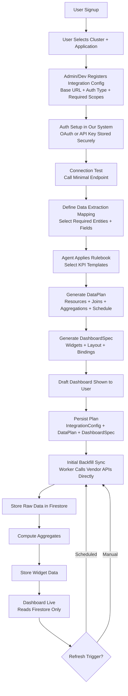
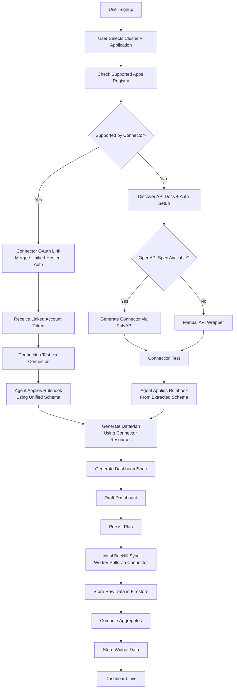
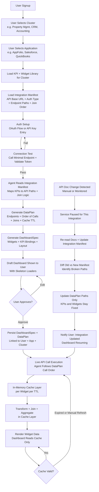

FlowChart without Any Tools

```mermaid
flowchart TD

A[User Signup] --> B[User Selects Cluster + Application]

B --> C[Admin/Dev Registers Integration Config<br/>Base URL + Auth Type + Required Scopes]

C --> D[Auth Setup in Our System<br/>OAuth or API Key Stored Securely]

D --> E[Connection Test<br/>Call Minimal Endpoint]

E --> F[Define Data Extraction Mapping<br/>Select Required Entities + Fields]

F --> G[Agent Applies Rulebook<br/>Select KPI Templates]

G --> H[Generate DataPlan<br/>Resources + Joins + Aggregations + Schedule]

H --> I[Generate DashboardSpec<br/>Widgets + Layout + Bindings]

I --> J[Draft Dashboard Shown to User]

J --> K[Persist Plan<br/>IntegrationConfig + DataPlan + DashboardSpec]

K --> L[Initial Backfill Sync<br/>Worker Calls Vendor APIs Directly]

L --> M[Store Raw Data in Firestore]
M --> N[Compute Aggregates]
N --> O[Store Widget Data]

O --> P[Dashboard Live<br/>Reads Firestore Only]

P --> Q{Refresh Trigger?}
Q -->|Scheduled| L
Q -->|Manual| L
```

Flow Chart with Merge/Unified.to + PolyAPI

```mermaid
flowchart TD

A[User Signup] --> B[User Selects Cluster + Application]

B --> C[Check Supported Apps Registry]

C --> D{Supported by Connector?}

%% CONNECTOR PATH
D -->|Yes| E[Connector OAuth Link<br/>Merge / Unified Hosted Auth]

E --> F[Receive Linked Account Token]

F --> G[Connection Test via Connector]

G --> H[Agent Applies Rulebook<br/>Using Unified Schema]

H --> I[Generate DataPlan<br/>Using Connector Resources]

I --> J[Generate DashboardSpec]

J --> K[Draft Dashboard]

K --> L[Persist Plan]

L --> M[Initial Backfill Sync<br/>Worker Pulls via Connector]

M --> N[Store Raw Data in Firestore]
N --> O[Compute Aggregates]
O --> P[Store Widget Data]

P --> Q[Dashboard Live]

%% FALLBACK PATH
D -->|No| R[Discover API Docs + Auth Setup]

R --> S{OpenAPI Spec Available?}

S -->|Yes| T[Generate Connector via PolyAPI]
S -->|No| U[Manual API Wrapper]

T --> V[Connection Test]
U --> V

V --> W[Agent Applies Rulebook<br/>From Extracted Schema]

W --> I
```

Updated Flowchasrt

```mermaid
flowchart TD
    A[User Signup] --> B[User Selects Cluster\ne.g. Property Mgmt, CRM, Accounting]
    B --> C[User Selects Application\ne.g. AppFolio, Salesforce, QuickBooks]
    C --> D[Load KPI + Widget Library for Cluster]
    D --> E[Load Integration Manifest\nAPI Base URL + Auth Type + Endpoint Paths + Join Order]

    E --> F[Auth Setup\nOAuth Flow or API Key Entry]
    F --> G[Connection Test\nCall Minimal Endpoint + Validate Token]
    G -->|Fail| F
    G -->|Pass| H[Agent Reads Integration Manifest\nMaps KPIs to API Paths + Join Logic]

    H --> I[Generate DataPlan\nEndpoints + Order of Calls + Joins + Cache TTL]
    I --> J[Generate DashboardSpec\nWidgets + KPI Bindings + Layout]
    J --> K[Draft Dashboard Shown to User\nWith Skeleton Loaders]
    K --> L{User Approves?}
    L -->|Edit| K
    L -->|Approve| M[Persist DashboardSpec + DataPlan\nLinked to User + App + Cluster]

    M --> N[Live API Call Execution\nAgent Follows DataPlan Call Order]
    N --> O[In-Memory Cache Layer\nper Widget per TTL]
    O --> P[Transform + Join + Aggregate\nin Cache Layer]
    P --> Q[Render Widget Data\nDashboard Reads Cache Only]

    Q --> R{Cache Valid?}
    R -->|Yes| Q
    R -->|Expired or Manual Refresh| N

    S[API Doc Change Detected\nManual or Monitored] --> T[Service Paused for This Integration]
    T --> U[Re-read Docs + Update Integration Manifest]
    U --> V[Diff Old vs New Manifest\nIdentify Broken Paths]
    V --> W[Update DataPlan Paths Only\nKPIs and Widgets Stay Fixed]
    W --> X[Notify User: Integration Updated\nDashboard Resuming]
    X --> N
```
