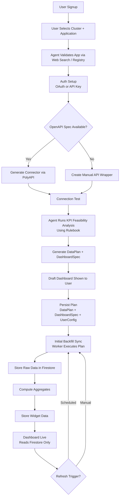

```mermaid
flowchart TD

A[User Signup] --> B[User Selects Cluster + Application]

B --> C[Agent Validates App via Web Search / Registry]

C --> D[Auth Setup<br/>OAuth or API Key]

D --> E{OpenAPI Spec Available?}

E -->|Yes| F[Generate Connector via PolyAPI]
E -->|No| G[Create Manual API Wrapper]

F --> H[Connection Test]
G --> H

H --> I[Agent Runs KPI Feasibility Analysis<br/>Using Rulebook]

I --> J[Generate DataPlan + DashboardSpec]

J --> K[Draft Dashboard Shown to User]

K --> L[Persist Plan<br/>DataPlan + DashboardSpec + UserConfig]

L --> M[Initial Backfill Sync<br/>Worker Executes Plan]

M --> N[Store Raw Data in Firestore]
N --> O[Compute Aggregates]
O --> P[Store Widget Data]

P --> Q[Dashboard Live<br/>Reads Firestore Only]
Q --> R{Refresh Trigger?}
R -->|Scheduled| M
R -->|Manual| M
```
