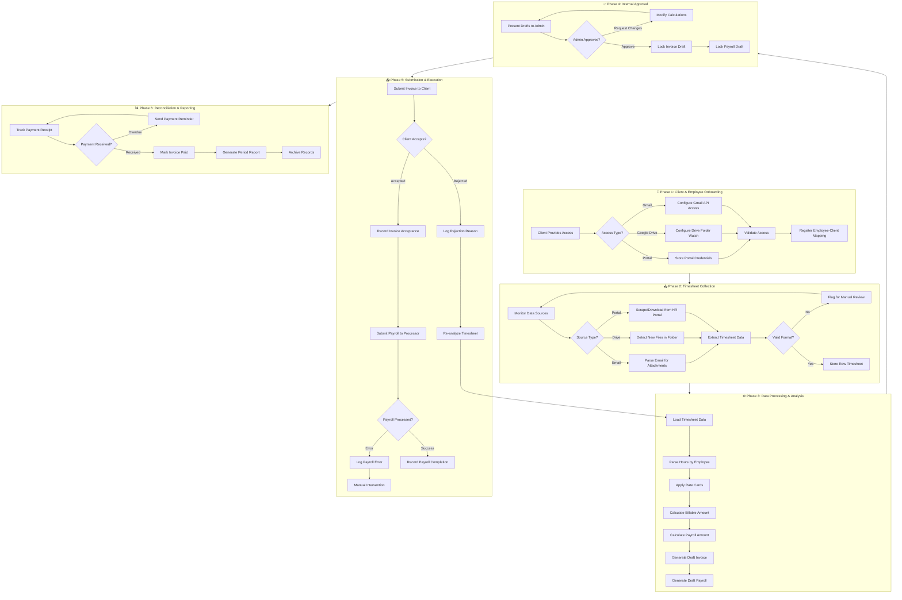
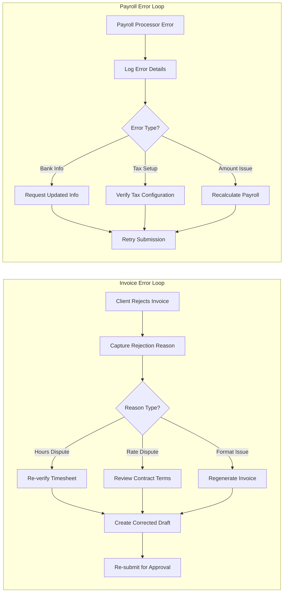

# Timesheet Automation Workflow Map

## Overview

This document outlines the complete workflow for automating timesheet processing, billing, and payroll for a software consultancy. The primary focus is **Case 1**: Employees working directly for a client through the consultancy.

---

## System Architecture & Data Flow

```
┌─────────────────────────────────────────────────────────────────────────────┐
│                           DATA SOURCES (INPUT)                              │
│                                                                             │
│  ┌──────────────┐    ┌──────────────┐    ┌──────────────┐                   │
│  │    Gmail     │    │ Google Drive │    │  HR Portal   │                   │
│  │  (Approved   │    │   (Shared    │    │   (Client    │                   │
│  │  Timesheets) │    │    Folder)   │    │   System)    │                   │
│  └──────┬───────┘    └──────┬───────┘    └──────┬───────┘                   │
│         │                   │                   │                           │
│         └───────────────────┴───────────────────┘                           │
│                             │                                               │
│                    Employee submits approved                                │
│                    timesheet via any channel                                │
└─────────────────────────────┬───────────────────────────────────────────────┘
                              │
                              ▼
┌─────────────────────────────────────────────────────────────────────────────┐
│                        DATA COLLECTION LAYER                                │
│                                                                             │
│  STEP 1: SOURCE DETECTION                                                   │
│  "Where did this timesheet come from?"                                      │
│  [Logic]: Monitor Gmail API, Drive webhooks, Portal scraper                 │
│                                                                             │
│  STEP 2: DOCUMENT EXTRACTION                                                │
│  "What format is it? PDF, Excel, Screenshot?"                               │
│  [Action]: OCR for images/PDFs, Parser for Excel/CSV                        │
│                                                                             │
│  STEP 3: VALIDATION                                                         │
│  "Does it have all required fields? Is it approved by client?"              │
│  [Check]: Employee ID, Hours, Date Range, Approval Signature                │
│                                                                             │
│  RESULT: Structured timesheet data OR flagged for manual review             │
└─────────────────────────────┬───────────────────────────────────────────────┘
                              │
                              ▼
┌─────────────────────────────────────────────────────────────────────────────┐
│                        PROCESSING ENGINE                                    │
│                                                                             │
│  ┌─────────────────────────────────────────────────────────────────────┐    │
│  │                    RATE CARD DATABASE                               │    │
│  │  ┌────────────────┬────────────────┬────────────────┐               │    │
│  │  │   Employee     │  Bill Rate     │   Pay Rate     │               │    │
│  │  ├────────────────┼────────────────┼────────────────┤               │    │
│  │  │   John Doe     │   $75/hour     │   $50/hour     │               │    │
│  │  │   Jane Smith   │   $95/hour     │   $65/hour     │               │    │
│  │  │   Bob Wilson   │   $85/hour     │   $55/hour     │               │    │
│  │  └────────────────┴────────────────┴────────────────┘               │    │
│  └─────────────────────────────────────────────────────────────────────┘    │
│                                                                             │
│  CALCULATION:                                                               │
│  ┌─────────────────────────────────────────────────────────────────────┐    │
│  │  Input: John Doe, 40 regular hours, 5 OT hours                      │    │
│  │                                                                     │    │
│  │  Invoice Amount = (40 × $75) + (5 × $75 × 1.5) = $3,562.50          │    │
│  │  Payroll Amount = (40 × $50) + (5 × $50 × 1.5) = $2,375.00          │    │
│  │  Consultancy Margin = $3,562.50 - $2,375.00 = $1,187.50             │    │
│  └─────────────────────────────────────────────────────────────────────┘    │
│                                                                             │
│  OUTPUT: Draft Invoice + Draft Payroll                                      │
└─────────────────────────────┬───────────────────────────────────────────────┘
                              │
                              ▼
┌─────────────────────────────────────────────────────────────────────────────┐
│                        ADMIN APPROVAL DASHBOARD                             │
│                                                                             │
│  ┌───────────────────────────────────────────────────────────────────┐      │
│  │  PENDING APPROVALS                                                │      │
│  │  ┌─────────────────────────────────────────────────────────────┐  │      │
│  │  │  Employee: John Doe          Period: Jan 1-15, 2026         │  │      │
│  │  │  Client: Bank of America     Status: ⏳ Awaiting Approval   │  │      │
│  │  │  ──────────────────────────────────────────────────────     │  │      │
│  │  │  Hours: 40 Regular + 5 OT                                   │  │      │
│  │  │  Invoice: $3,562.50          Payroll: $2,375.00             │  │      │
│  │  │  ──────────────────────────────────────────────────────     │  │      │
│  │  │  [✓ APPROVE]  [✏️ MODIFY]  [✗ REJECT]  [⏸️ HOLD]            │  │      │
│  │  └─────────────────────────────────────────────────────────────┘  │      │
│  └───────────────────────────────────────────────────────────────────┘      │
│                                                                             │
│  On Approve → Lock drafts, proceed to submission                            │
│  On Modify  → Adjust values, recalculate, return to review                  │
│  On Reject  → Notify employee, request correction                           │
└─────────────────────────────┬───────────────────────────────────────────────┘
                              │
           ┌──────────────────┴──────────────────┐
           │                                     │
           ▼                                     ▼
┌──────────────────────────────┐    ┌──────────────────────────────┐
│    INVOICE SUBMISSION        │    │    PAYROLL SUBMISSION        │
│                              │    │                              │
│  Target: Client (BofA)       │    │  Target: Payroll Processor   │
│                              │    │                              │
│  Methods:                    │    │  Methods:                    │
│  • QuickBooks API            │    │  • Gusto API                 │
│  • Xero API                  │    │  • ADP Upload                │
│  • FreshBooks API            │    │  • Paychex API               │
│  • Email (PDF attachment)    │    │  • CSV Export                │
│  • Client Portal Upload      │    │                              │
│                              │    │                              │
│  → POST /invoice/submit      │    │  → POST /payroll/process     │
│    { client: "BofA",         │    │    { employee: "john_doe",   │
│      amount: 3562.50,        │    │      gross_pay: 2375.00,     │
│      period: "Jan 1-15" }    │    │      period: "Jan 1-15" }    │
└──────────────┬───────────────┘    └──────────────┬───────────────┘
               │                                   │
               ▼                                   ▼
┌──────────────────────────────┐    ┌──────────────────────────────┐
│     CLIENT RESPONSE          │    │    PAYROLL RESULT            │
│                              │    │                              │
│  ┌────────────────────────┐  │    │  ┌────────────────────────┐  │
│  │ Status: ACCEPTED ✓     │  │    │  │ Status: PROCESSED ✓    │  │
│  │ Invoice #: INV-2026-42 │  │    │  │ Check #: 100457        │  │
│  │ Due Date: Jan 30, 2026 │  │    │  │ Net Pay: $1,781.25     │  │
│  └────────────────────────┘  │    │  │ Taxes: $593.75         │  │
│           OR                 │    │  └────────────────────────┘  │
│  ┌────────────────────────┐  │    │           OR                 │
│  │ Status: REJECTED ✗     │  │    │  ┌────────────────────────┐  │
│  │ Reason: "Hours don't   │  │    │  │ Status: ERROR ✗        │  │
│  │  match our records"    │  │    │  │ Reason: "Invalid bank  │  │
│  │                        │  │    │  │  routing number"       │  │
│  │ → TRIGGER ERROR LOOP   │  │    │  │ → TRIGGER ERROR LOOP   │  │
│  └────────────────────────┘  │    │  └────────────────────────┘  │
└──────────────────────────────┘    └──────────────────────────────┘
               │                                   │
               └───────────────┬───────────────────┘
                               │
                               ▼
┌─────────────────────────────────────────────────────────────────────────────┐
│                        RECONCILIATION & REPORTING                           │
│                                                                             │
│  ┌───────────────────────────────────────────────────────────────────┐      │
│  │  PAYMENT TRACKING                                                 │      │
│  │  ┌─────────────┬──────────────┬────────────┬──────────────────┐   │      │
│  │  │ Invoice #   │ Client       │ Amount     │ Status           │   │      │
│  │  ├─────────────┼──────────────┼────────────┼──────────────────┤   │      │
│  │  │ INV-2026-40 │ BofA         │ $3,200.00  │ ✓ PAID           │   │      │
│  │  │ INV-2026-41 │ Wells Fargo  │ $4,150.00  │ ⏳ PENDING (5d)  │   │      │
│  │  │ INV-2026-42 │ BofA         │ $3,562.50  │ ⚠️ OVERDUE (32d) │   │      │
│  │  └─────────────┴──────────────┴────────────┴──────────────────┘   │      │
│  └───────────────────────────────────────────────────────────────────┘      │
│                                                                             │
│  Actions:                                                                   │
│  • Overdue > 30 days → Auto-send reminder email                             │
│  • Overdue > 60 days → Escalate to admin                                    │
│  • Payment received → Mark complete, update ledger                          │
│  • Generate weekly/monthly/quarterly reports                                │
└─────────────────────────────────────────────────────────────────────────────┘
```

---

## Error Handling Flow

```
┌─────────────────────────────────────────────────────────────────────────────┐
│                         ERROR LOOP: INVOICE REJECTED                        │
│                                                                             │
│  Trigger: Client rejects invoice with reason                                │
│                                                                             │
│  ┌────────────────────────────────────────────────────────────────────┐     │
│  │  Client Response:                                                  │     │
│  │  "Rejected - Employee was on PTO for 2 days, not 40 regular hours" │     │
│  └────────────────────────────────────────────────────────────────────┘     │
│                              │                                              │
│                              ▼                                              │
│  ┌────────────────────────────────────────────────────────────────────┐     │
│  │  STEP 1: Log rejection reason in system                            │     │
│  │  STEP 2: Pull original timesheet source document                   │     │
│  │  STEP 3: Compare with client's claim                               │     │
│  └────────────────────────────────────────────────────────────────────┘     │
│                              │                                              │
│              ┌───────────────┴───────────────┐                              │
│              ▼                               ▼                              │
│  ┌─────────────────────────┐    ┌─────────────────────────┐                 │
│  │  OUR ERROR              │    │  CLIENT ERROR           │                 │
│  │  ────────────────────   │    │  ────────────────────   │                 │
│  │  1. Recalculate hours   │    │  1. Attach original     │                 │
│  │  2. Adjust invoice      │    │     approved timesheet  │                 │
│  │  3. Create correction   │    │  2. Send clarification  │                 │
│  │  4. Re-submit for       │    │  3. Request re-review   │                 │
│  │     admin approval      │    │  4. Await new response  │                 │
│  └────────────┬────────────┘    └────────────┬────────────┘                 │
│               │                              │                              │
│               └──────────────┬───────────────┘                              │
│                              ▼                                              │
│  ┌────────────────────────────────────────────────────────────────────┐     │
│  │  Create audit trail entry documenting the discrepancy              │     │
│  │  Return to PROCESSING ENGINE with corrected data                   │     │
│  └────────────────────────────────────────────────────────────────────┘     │
└─────────────────────────────────────────────────────────────────────────────┘


┌─────────────────────────────────────────────────────────────────────────────┐
│                         ERROR LOOP: PAYROLL FAILED                          │
│                                                                             │
│  Trigger: Payroll processor returns error                                   │
│                                                                             │
│  ┌────────────────────────────────────────────────────────────────────┐     │
│  │  Processor Response:                                               │     │
│  │  { "error": "INVALID_ROUTING", "field": "bank_routing_number" }    │     │
│  └────────────────────────────────────────────────────────────────────┘     │
│                              │                                              │
│                              ▼                                              │
│  ┌────────────────────────────────────────────────────────────────────┐     │
│  │  STEP 1: Log error with full API response                          │     │
│  │  STEP 2: Classify error type                                       │     │
│  └────────────────────────────────────────────────────────────────────┘     │
│                              │                                              │
│         ┌────────────────────┼────────────────────┐                         │
│         ▼                    ▼                    ▼                         │
│  ┌─────────────────┐  ┌─────────────────┐  ┌─────────────────┐              │
│  │ RETRYABLE       │  │ DATA ISSUE      │  │ SYSTEM ISSUE    │              │
│  │ (Network/Rate)  │  │ (Bank/Tax/SSN)  │  │ (API Down)      │              │
│  │ ─────────────── │  │ ─────────────── │  │ ─────────────── │              │
│  │ Retry with      │  │ Alert admin +   │  │ Queue for retry │              │
│  │ exponential     │  │ notify employee │  │ when service    │              │
│  │ backoff         │  │ to update info  │  │ recovers        │              │
│  └────────┬────────┘  └────────┬────────┘  └────────┬────────┘              │
│           │                    │                    │                       │
│           └────────────────────┴────────────────────┘                       │
│                              │                                              │
│                              ▼                                              │
│  ┌────────────────────────────────────────────────────────────────────┐     │
│  │  Once resolved → Retry payroll submission                          │     │
│  │  Max retries exceeded → Manual intervention required               │     │
│  └────────────────────────────────────────────────────────────────────┘     │
└─────────────────────────────────────────────────────────────────────────────┘


┌─────────────────────────────────────────────────────────────────────────────┐
│                     ERROR LOOP: ADMIN APPROVED WRONG DATA                   │
│                                                                             │
│  Trigger: Admin realizes mistake after approval but BEFORE submission       │
│                                                                             │
│  ┌────────────────────────────────────────────────────────────────────┐     │
│  │  Dashboard shows: "Invoice #INV-2026-42 - APPROVED, NOT SUBMITTED" │     │
│  │  Admin clicks: [🔓 RECALL DRAFT]                                   │     │
│  └────────────────────────────────────────────────────────────────────┘     │
│                              │                                              │
│                              ▼                                              │
│  ┌────────────────────────────────────────────────────────────────────┐     │
│  │  STEP 1: Unlock invoice and payroll drafts                         │     │
│  │  STEP 2: Return to "PENDING APPROVAL" state                        │     │
│  │  STEP 3: Admin makes corrections                                   │     │
│  │  STEP 4: Re-approve                                                │     │
│  │  STEP 5: Proceed to submission                                     │     │
│  └────────────────────────────────────────────────────────────────────┘     │
│                                                                             │
│  If error discovered AFTER submission:                                      │
│  ─────────────────────────────────────                                      │
│  • Invoice: Issue credit memo + corrected invoice                           │
│  • Payroll: Issue correction in next pay period (if already processed)      │
│             OR void and resubmit (if not yet processed)                     │
└─────────────────────────────────────────────────────────────────────────────┘
```

---

## Workflow Diagram



---

## Detailed Phase Breakdown

### 🔐 Phase 1: Client & Employee Onboarding

| Step | Action | Owner | System Requirement |
|------|--------|-------|-------------------|
| 1.1 | Receive access credentials from client organization | Admin | Secure credential storage |
| 1.2 | Configure Gmail API OAuth if email-based | System | Google Workspace API integration |
| 1.3 | Set up Drive folder monitoring if file-based | System | Google Drive API integration |
| 1.4 | Store HR portal credentials (encrypted) | System | Credential vault |
| 1.5 | Test and validate all access points | Admin | Access validation module |
| 1.6 | Map employee → client → rate card relationships | Admin | Employee management database |
| 1.7 | Configure notification preferences | Admin | Notification settings |

> [!IMPORTANT]
> All credentials must be stored encrypted. OAuth tokens should be refreshed automatically before expiry.

---

### 📥 Phase 2: Timesheet Collection

#### 2.1 Data Source Monitoring

| Source | Monitoring Method | Frequency |
|--------|-------------------|-----------|
| **Gmail** | Gmail API push notifications or polling | Real-time / Every 15 min |
| **Google Drive** | Drive API change detection | Every 5-15 min |
| **HR Portal** | Scheduled web scraping / API calls | Daily at configured time |

#### 2.2 Supported Timesheet Formats

- **PDF**: OCR extraction with validation
- **Excel/CSV**: Direct parsing
- **Screenshots/Images**: OCR + structured extraction
- **Portal Exports**: Native format parsing

#### 2.3 Data Extraction Fields

| Field | Required | Description |
|-------|----------|-------------|
| Employee Name/ID | ✅ | Identifier to match internal records |
| Client Name | ✅ | For billing attribution |
| Pay Period | ✅ | Start and end dates |
| Regular Hours | ✅ | Standard working hours |
| Overtime Hours | ⬜ | If applicable |
| Approval Status | ✅ | Client-approved indicator |
| Approver Name | ⬜ | Client approver identity |

> [!WARNING]
> Timesheets without clear approval indicators should be flagged for manual verification before processing.

---

### ⚙️ Phase 3: Data Processing & Analysis

#### 3.1 Processing Pipeline

```
Raw Timesheet → Validation → Normalization → Calculation → Draft Generation
```

#### 3.2 Rate Card Application

| Rate Type | Description | Example |
|-----------|-------------|---------|
| Standard Rate | Regular hourly billing rate | $75/hour |
| Overtime Rate | Hours beyond threshold | 1.5x standard |
| Weekend Rate | Weekend work premium | 2x standard |
| Employee Pay Rate | What employee receives | $50/hour |

#### 3.3 Calculations Performed

1. **Total Hours** = Regular + Overtime + Weekend
2. **Gross Billable** = Σ(Hours × Applicable Rate)
3. **Employee Gross Pay** = Σ(Hours × Pay Rate)
4. **Consultancy Margin** = Gross Billable - Employee Gross Pay
5. **Taxes & Deductions** = Based on payroll configuration

---

### ✅ Phase 4: Internal Approval (Admin Review)

#### 4.1 Draft Review Interface

The admin dashboard should display:

- [ ] Employee name and pay period
- [ ] Hours summary (regular, OT, weekend)
- [ ] Calculated invoice amount
- [ ] Calculated payroll amount
- [ ] Comparison with previous periods (anomaly detection)
- [ ] Source document preview

#### 4.2 Approval Actions

| Action | Result |
|--------|--------|
| **Approve** | Lock drafts, proceed to submission |
| **Reject** | Return to employee for clarification |
| **Modify** | Adjust hours/rates, recalculate |
| **Hold** | Pause processing, set reminder |

> [!NOTE]
> Consider implementing **auto-approval rules** for timesheets that match expected patterns (e.g., 40 hours, regular rate, returning employee).

---

### 📤 Phase 5: Submission & Execution

#### 5.1 Invoice Submission

| Method | Integration |
|--------|-------------|
| Email (PDF) | SMTP with template engine |
| Accounting Software | QuickBooks/Xero/FreshBooks API |
| Client Portal | Custom upload integration |

#### 5.2 Payroll Submission

| Processor | Integration Method |
|-----------|-------------------|
| Gusto | API integration |
| ADP | File upload / API |
| Paychex | File upload / API |
| Custom | CSV/Excel export |

#### 5.3 Error Handling Loops



---

### 📊 Phase 6: Reconciliation & Reporting

#### 6.1 Payment Tracking

| Status | Action |
|--------|--------|
| Pending | Monitor aging |
| Overdue (>30 days) | Send reminder |
| Overdue (>60 days) | Escalate to admin |
| Received | Mark complete, record in ledger |

#### 6.2 Reporting Outputs

- **Weekly Summary**: Hours processed, pending approvals
- **Monthly Report**: Revenue, payroll costs, margins by client
- **Quarterly Analysis**: Trends, top clients, employee utilization
- **Audit Trail**: Complete log of all actions and changes

---

## Error Scenarios & Recovery

### Scenario 1: Invalid Timesheet Format

```
Trigger: OCR/Parser cannot extract required fields
Action:
  1. Flag timesheet as "Needs Review"
  2. Notify admin with source file attached
  3. Admin manually enters data OR contacts employee
  4. Resume normal processing
```

### Scenario 2: Admin Approves Wrong Data

```
Trigger: Admin realizes error after approval but before submission
Action:
  1. Admin clicks "Recall Draft"
  2. System unlocks invoice/payroll draft
  3. Corrections made, re-approved
  4. Proceed to submission
```

### Scenario 3: Client Rejects Invoice

```
Trigger: Client disputes invoice (hours, rates, etc.)
Action:
  1. Log rejection with client's stated reason
  2. Pull original timesheet source
  3. If client error → provide evidence, resubmit
  4. If consultancy error → correct and resubmit
  5. Generate audit entry for discrepancy
```

### Scenario 4: Payroll Processing Failure

```
Trigger: Payroll API returns error
Action:
  1. Log full error response
  2. Determine if retryable (network) or requires fix (data)
  3. If retryable → exponential backoff retry
  4. If data issue → alert admin, hold payroll
  5. Admin fixes issue, manually triggers retry
```

### Scenario 5: Duplicate Timesheet Submission

```
Trigger: Same timesheet uploaded twice (by email + drive)
Action:
  1. Hash-based duplicate detection
  2. Keep first submission, flag second as duplicate
  3. Notify admin of duplicate detection
```

---

## System Integration Points

| System | Purpose | Integration Type |
|--------|---------|-----------------|
| Gmail/Google Workspace | Email monitoring, Drive access | OAuth 2.0 + API |
| HR Portals (varies) | Timesheet source | Web scraping / API |
| QuickBooks/Xero | Invoice generation & tracking | OAuth + REST API |
| Gusto/ADP/Paychex | Payroll processing | API / File upload |
| Notification Service | Alerts & reminders | Email/SMS/Slack |
| Document Storage | Archival | GCS/S3/Azure Blob |

---

## Future Consideration: Case 2 (Consultancy-to-Consultancy)

When processing timesheets through intermediary consultancies:

1. **Incoming Data**: Consultancy A sends consolidated timesheet to Consultancy B
2. **Format Standardization**: Need mapping layer for different consultancy formats
3. **Rate Translation**: Bill rate from A → margin for B → pay rate for employee
4. **Dual Approval**: May require approval from both consultancies
5. **Integration**: Likely via portal upload, email, or EDI

> [!TIP]
> For Case 2, consider building a **Consultancy Partner Portal** where partner consultancies can submit and track timesheets in a standardized format.

---

## Summary Workflow States

| State | Description | Next Actions |
|-------|-------------|--------------|
| `AWAITING_TIMESHEET` | Monitoring for new data | Collection triggers |
| `TIMESHEET_RECEIVED` | Raw data captured | Parse & validate |
| `NEEDS_REVIEW` | Parsing failed or anomaly | Manual intervention |
| `PROCESSING` | Calculations in progress | Auto-proceed |
| `PENDING_APPROVAL` | Drafts ready for admin | Approve/Reject/Modify |
| `APPROVED` | Admin approved drafts | Submit to client/payroll |
| `INVOICE_SUBMITTED` | Invoice sent to client | Await response |
| `INVOICE_DISPUTED` | Client rejected | Error loop |
| `INVOICE_ACCEPTED` | Client approved | Process payroll |
| `PAYROLL_SUBMITTED` | Payroll sent to processor | Await result |
| `PAYROLL_ERROR` | Processor returned error | Error loop |
| `COMPLETED` | All steps successful | Reconciliation |
| `AWAITING_PAYMENT` | Invoice unpaid | Payment tracking |
| `CLOSED` | Payment received, archived | — |
